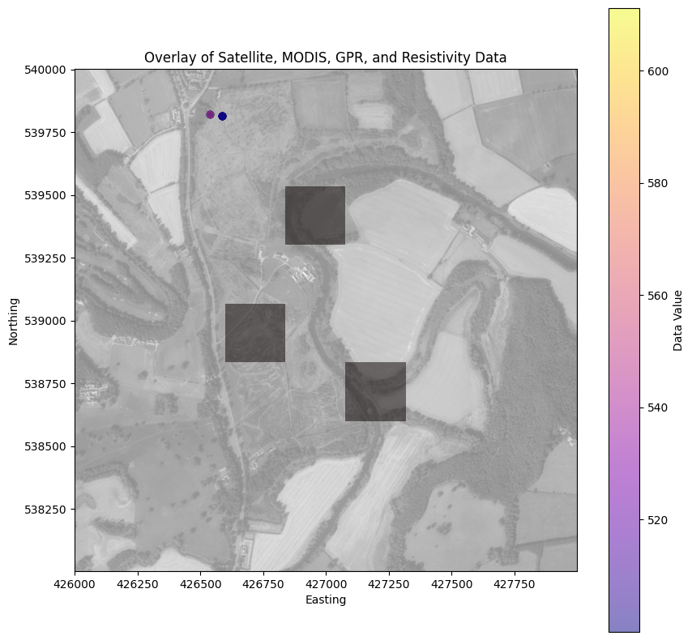
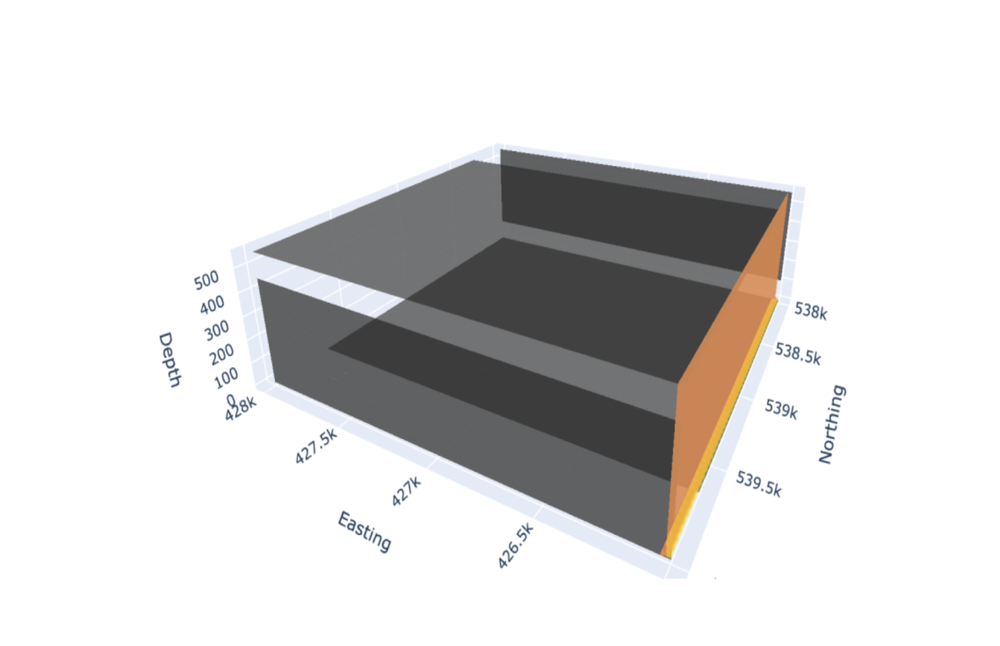

# Datacube Integration for Environmental Characterization

This repository contains the code and data for creating a datacube that integrates multi-source spatial data for comprehensive environmental characterization of the Low Burn Hall Estate. The project combines field measurements (resistivity and ground-penetrating radar), remotely sensed imagery (satellite) and modelled data products (MODIS) into a unified spatial framework.

## Introduction

Effective management of natural resources requires a comprehensive understanding of the target environment. This often necessitates the integration of data from multiple sources to fully characterize the site of interest. The datacube approach provides a powerful framework for combining diverse datasets into a unified spatial and temporal structure, enabling efficient analysis and visualization.

## Data Sources

The following data sources were used in this project:

- Satellite imagery of the estate
- MODIS land surface temperature (LST) and vegetation index products
- Resistivity measurements collected at two locations within the estate
- Ground-penetrating radar (GPR) surveys conducted at the same locations

## Methodology

The data integration workflow involved the following steps:

1. Pre-processing and cleaning of the raw data
2. Spatial alignment of the datasets to a common coordinate reference system
3. Resampling of the data to a consistent spatial resolution
4. Creation of the datacube using the xarray library
5. Visualization of the datacube layers using matplotlib and plotly

## Results

### 2D Composite Image

The 2D composite image provides an overview of the spatial patterns and interrelationships of surface and subsurface properties across the Low Burn Hall Estate. The satellite imagery forms the base layer, with MODIS LST day values overlaid using a colormap and transparency. The resistivity models and GPR interpretation points are plotted at their respective locations.

### 3D Interactive Visualization

The 3D interactive visualization allows for exploration of the datacube in a more immersive manner. The different data layers can be toggled on and off, and the opacity and surface count can be adjusted to reveal the underlying structures. However, due to the large size of the dataset, the 3D rendering encountered some issues.

### Poster

A poster was created to present the findings of this project. The poster provides an overview of the datacube construction process, including the dimensions used, the workflow and the benefits of the datacube approach. The poster also highlights the key results, limitations and potential improvements of the project.